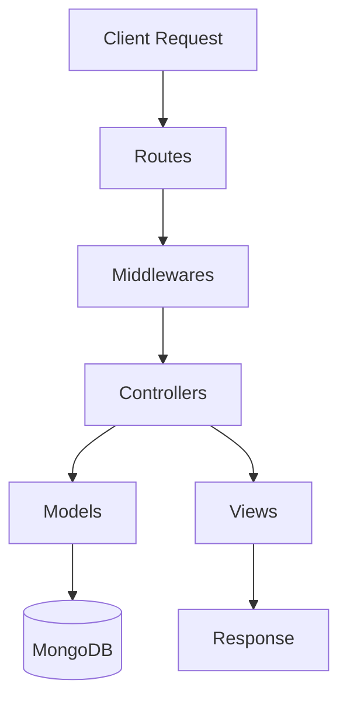

# <p align="center">✨ Glowly ✨</p>
<p align="center">
  <strong>Your Premium Cosmetic Destination</strong><br>
  <em>A Full-Stack E-commerce Platform for Beauty and Elegance</em>
</p>

<p align="center">
  
  
  
</p>

---

## 🚀 Tech Stack

### **Frontend & Design**
[](https://skillicons.dev)
- **EJS**: Powerful templating engine for dynamic content rendering.
- **Chart.js**: For real-time sales and revenue analytics dashboard.
- **Notyf / SweetAlert2**: For sleek, modern user notifications and alerts.

### **Backend & Logic**
[VP](https://skillicons.dev)
- **Node.js & Express**: High-performance server-side execution.
- **MongoDB & Mongoose**: Flexible NoSQL database with schema-based modeling.
- **Passport.js**: Robust authentication including Google OAuth 2.0.

### **External Services & Utilities**
[](https://skillicons.dev)
- **Razorpay**: Integrated secure payment gateway.
- **Cloudinary**: Cloud-based image management and optimization.
- **Nodemailer**: Automated transactional emails and OTP services.
- **ExcelJS & PDFKit**: Professional report and invoice generation.

---

## 📖 Description

**Glowly** is a state-of-the-art e-commerce ecosystem specifically tailored for the cosmetic industry. It provides a seamless shopping experience for users while offering a comprehensive management suite for administrators. From AI-ready image processing with Sharp to real-time analytics, Glowly is built with scalability and user experience at its core.

---

## 🏗️ MVC Architecture Highlights

Glowly follows the **Model-View-Controller (MVC)** architectural pattern to ensure a clean separation of concerns, scalability, and ease of maintenance.



-   **Models**: Define the structure of data (Users, Products, Orders) and interact with MongoDB.
-   **Views**: The user interface, built using EJS templates and served dynamically.
-   **Controllers**: The "brain" of the app. Processes requests, interacts with models, and returns views/data.
-   **Middlewares**: Handle authentication, authorization, and error processing before reaching controllers.

---

## 🌟 Key Features

### **👤 For Users**
-   **Omnichannel Auth**: Login via Email/Password or Google OAuth with OTP verification.
-   **Smart Shopping**: Advanced search, multi-category filtering, and product variants.
-   **Checkout Flow**: Seamless Razorpay integration with wallet system and coupon support.
-   **Account Hub**: Manage multiple addresses, track orders, and view transaction history.
-   **Interactive UI**: Live notifications, image cropping for profiles, and mobile-responsive design.

### **🛡️ For Admins**
-   **Analytics Dashboard**: Visual representations of revenue, sales, and customer growth.
-   **Inventory Command**: Full CRUD on products, brands, and categories with inventory alerts.
-   **Dynamic Offers**: Create product-specific offers, referral rewards, and coupon codes.
-   **Report Engine**: Export detailed sales reports in Excel and PDF formats.
-   **Order Control**: Manage order statuses, return requests, and cancellations.

---

## 📁 Folder Structure

```text
glowly.com-2025/
├── 📂 config/          # Database & Cloudinary configurations
├── 📂 controllers/     # Request handling logic (The 'C' in MVC)
├── 📂 helpers/         # Utility functions & helper methods
├── 📂 middlewares/     # Auth & validation middlewares
├── 📂 models/          # Mongoose schemas (The 'M' in MVC)
├── 📂 public/          # Static assets (CSS, JS, Images)
├── 📂 routes/          # Express route definitions
├── 📂 views/           # EJS templates (The 'V' in MVC)
├── 📄 server.js        # Application entry point
└── 📄 package.json     # Project dependencies
```

---

## 🔐 Security Highlights

-   **Data Protection**: Password hashing using `bcrypt`.
-   **Authentication**: Secure session management and JWT-based protection for APIs.
-   **Payment Security**: Verified Razorpay integration with signature validation.
-   **Safety First**: Input sanitization, CSRF protection, and route-level authorization.

---

## 🛠️ Installation & Setup

1.  **Clone the Repo**
    ```bash
    git clone https://github.com/your-username/glowly.com.git
    ```
2.  **Install Dependencies**
    ```bash
    npm install
    ```
3.  **Configure Environment**
    Create a `.env` file and add:
    ```env
    PORT=3000
    MONGODB_URI=your_mongodb_uri
    RAZORPAY_KEY_ID=your_key
    RAZORPAY_SECRET=your_secret
    CLOUDINARY_URL=your_url
    ```
4.  **Run Application**
    ```bash
    npm run dev
    ```

---

<p align="center">
  Made with ❤️ by the Glowly Team
</p>
