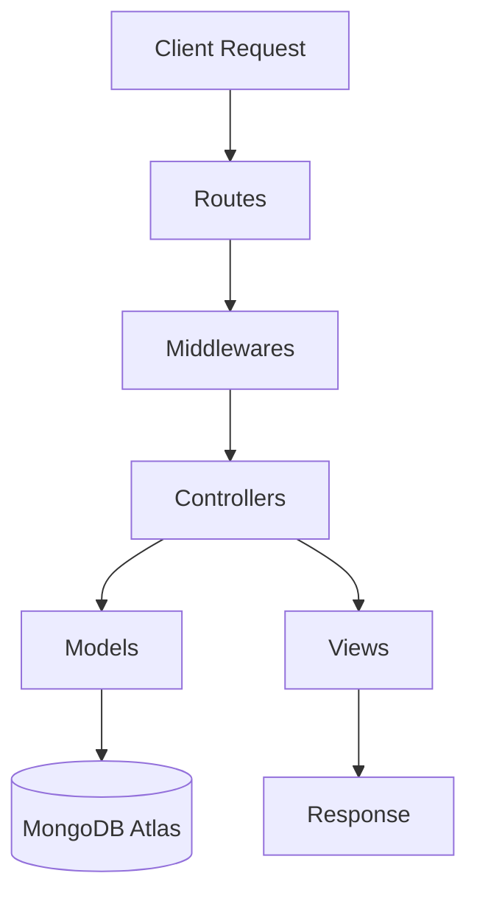

<p align="center">
  
</p>

<p align="center">
  <strong>Your Premium Cosmetic Destination</strong><br>
  <em>A Full-Stack E-commerce Platform for Beauty and Elegance</em>
</p>

<p align="center">
  
  
  
  
</p>

---

## Tech Stack

### Frontend & Design

<p>
  
  
  
  
  
  
  
</p>

- **EJS**: Powerful templating engine for dynamic server-side content rendering.
- **Chart.js**: For real-time sales and revenue analytics dashboard.
- **Notyf / SweetAlert2**: For sleek, modern user notifications and alerts.

### Backend & Logic

<p>
  
  
  
  
  
  
</p>

- **Node.js & Express**: High-performance server-side execution and routing.
- **MongoDB Atlas**: Cloud-based NoSQL database with schema-based modeling.
- **Passport.js**: Robust authentication including Google OAuth 2.0.
- **JWT & bcrypt**: Secure token-based auth and password hashing.

### External Services & Utilities

<p>
  
  
  
  
  
</p>

- **Razorpay**: Integrated secure payment gateway with signature validation.
- **Cloudinary**: Cloud-based image management and optimization.
- **Nodemailer**: Automated transactional emails and OTP verification.
- **ExcelJS & PDFKit**: Professional report and invoice generation.
- **Sharp**: High-performance image processing and resizing.

---

## Description

**Glowly** is a state-of-the-art e-commerce ecosystem specifically tailored for the cosmetic industry. It provides a seamless shopping experience for users while offering a comprehensive management suite for administrators. From AI-ready image processing with Sharp to real-time analytics, Glowly is built with scalability and user experience at its core.

---

## MVC Architecture

Glowly follows the **Model-View-Controller (MVC)** architectural pattern to ensure a clean separation of concerns, scalability, and ease of maintenance.



| Layer | Responsibility |
|---|---|
| **Models** | Define data structure (Users, Products, Orders) and interact with MongoDB |
| **Views** | User interface built using EJS templates, served dynamically |
| **Controllers** | Process requests, interact with models, and return views or data |
| **Middlewares** | Handle authentication, authorization, and error processing |

---

## Key Features

### For Users

- **Omnichannel Auth**: Login via Email/Password or Google OAuth with OTP verification.
- **Smart Shopping**: Advanced search, multi-category filtering, and product variants.
- **Checkout Flow**: Seamless Razorpay integration with wallet system and coupon support.
- **Account Hub**: Manage multiple addresses, track orders, and view transaction history.
- **Interactive UI**: Live notifications, image cropping for profiles, and mobile-responsive design.

### For Admins

- **Analytics Dashboard**: Visual representations of revenue, sales, and customer growth.
- **Inventory Command**: Full CRUD on products, brands, and categories with inventory alerts.
- **Dynamic Offers**: Create product-specific offers, referral rewards, and coupon codes.
- **Report Engine**: Export detailed sales reports in Excel and PDF formats.
- **Order Control**: Manage order statuses, return requests, and cancellations.

---

## Folder Structure

```text
glowly.com-2025/
├── config/             # Database & Cloudinary configurations
├── controllers/        # Request handling logic (The 'C' in MVC)
├── helpers/            # Utility functions & helper methods
├── middlewares/        # Auth & validation middlewares
├── models/             # Mongoose schemas (The 'M' in MVC)
├── public/             # Static assets (CSS, JS, Images)
├── routes/             # Express route definitions
├── views/              # EJS templates (The 'V' in MVC)
├── .dockerignore       # Docker build exclusions
├── docker-compose.yml  # Multi-container Docker setup
├── Dockerfile          # Container image definition
├── server.js           # Application entry point
└── package.json        # Project dependencies & scripts
```

---

## Security Highlights

- **Data Protection**: Password hashing using `bcrypt`.
- **Authentication**: Secure session management and JWT-based API protection.
- **Payment Security**: Verified Razorpay integration with HMAC signature validation.
- **Input Safety**: Input sanitization, CSRF protection, and route-level authorization.
- **No Credentials Leaked**: All secrets managed via environment variables (`.env`).

---

## Installation & Setup

### Local Development

1. **Clone the repository**
    ```bash
    git clone https://github.com/your-username/glowly.com-2025.git
    cd glowly.com-2025
    ```

2. **Install dependencies**
    ```bash
    npm install
    ```

3. **Configure environment variables**
    ```bash
    cp .env.example .env
    ```

4. **Start the development server**
    ```bash
    npm run dev
    ```

### Docker Setup

1. **Build and run with Docker Compose**
    ```bash
    docker-compose up --build
    ```

2. **Stop containers**
    ```bash
    docker-compose down
    ```

---

## CI/CD Pipeline

This project uses **GitHub Actions** for continuous integration and deployment.

| Trigger | Action |
|---|---|
| Push to `main` / `master` | Build Docker image and push to Docker Hub |
| Pull Request to `main` | Validate build only |

Required GitHub repository secrets: `DOCKER_USERNAME`, `DOCKER_PASSWORD`.

---

<p align="center">
  Made with <span style="color:#FF69B4">&#9829;</span> by the Glowly Team
</p>
